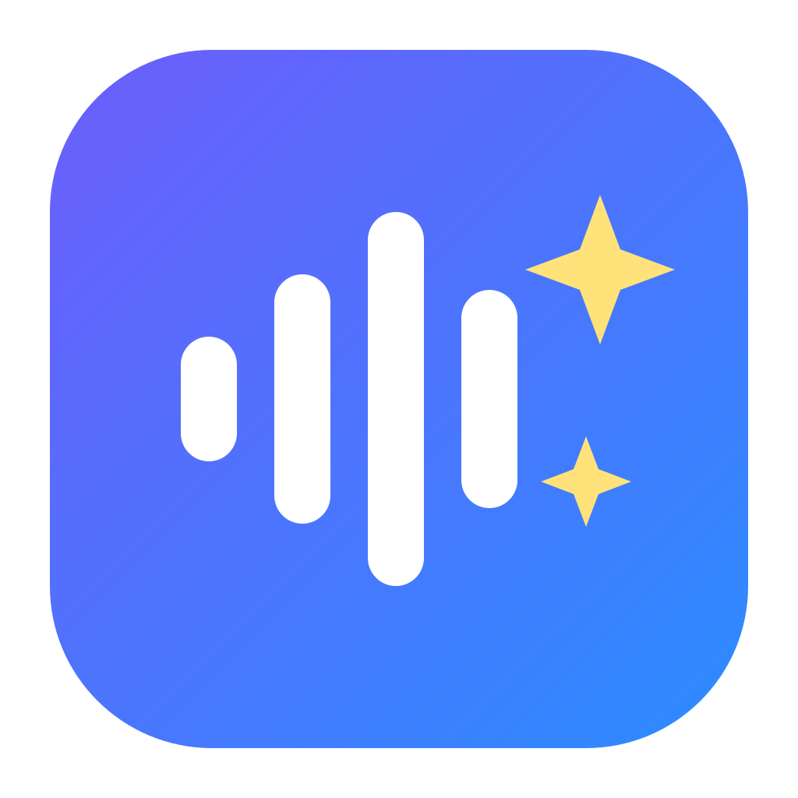
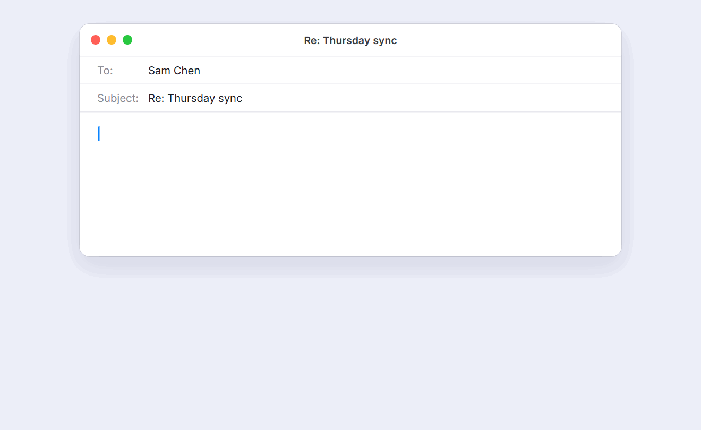
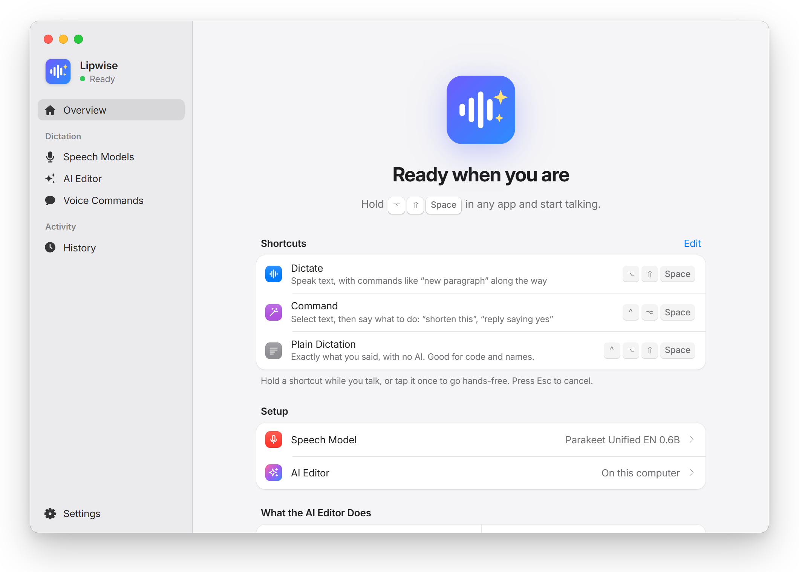
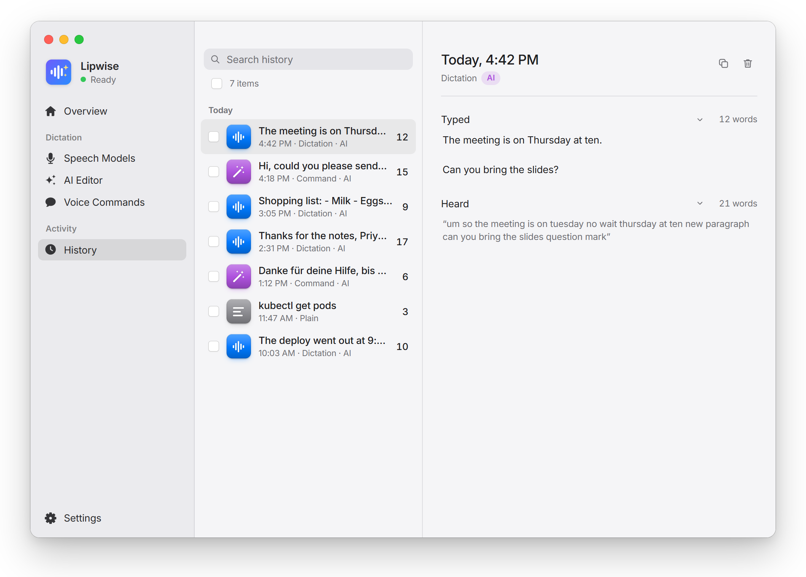
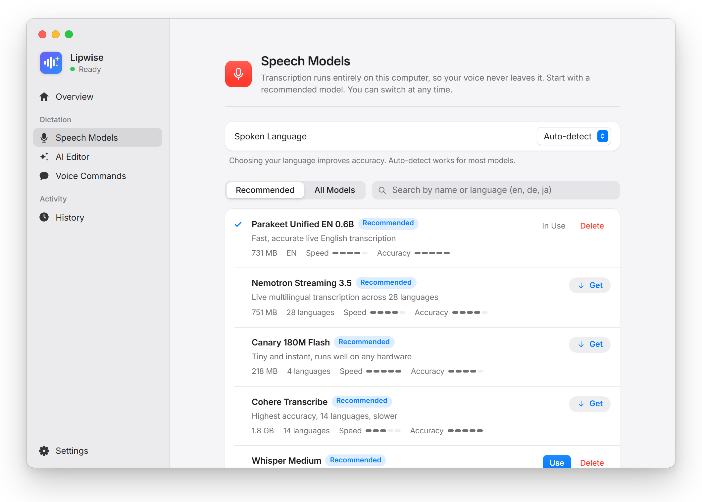
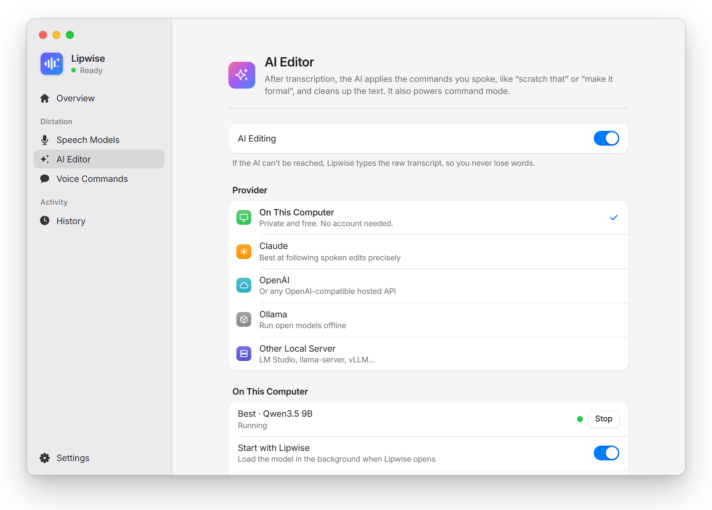
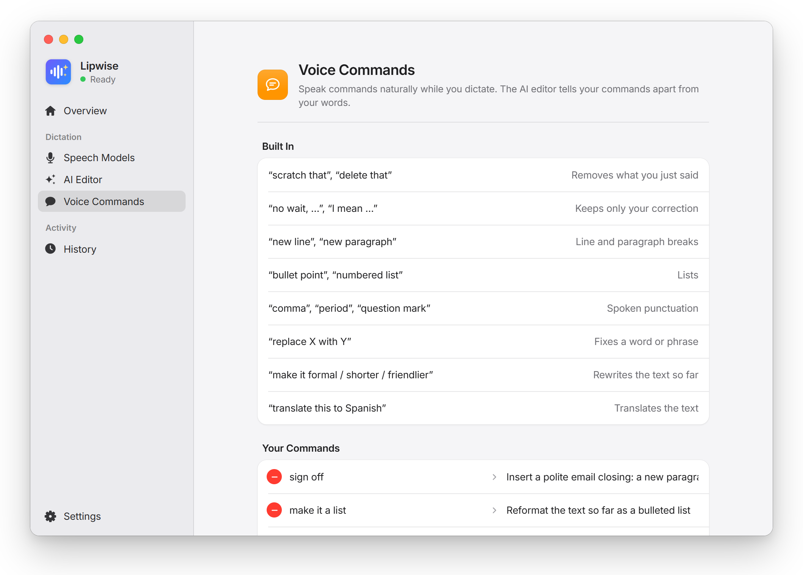

<p align="center">
  
</p>

<h1 align="center">Lipwise</h1>

<p align="center">
  <b>Speak naturally. Lipwise types what you meant.</b><br>
  Private voice dictation for every app on your computer, with an AI editor that understands “scratch that”.
</p>

<p align="center">
  <a href="https://github.com/lnenad/lipwise/releases/latest"></a>
  <a href="https://github.com/lnenad/lipwise/actions/workflows/build.yml"></a>
  
  <a href="LICENSE"></a>
</p>

<p align="center">
  <a href="https://github.com/lnenad/lipwise/releases/latest"><b>Download</b></a> ·
  <a href="#what-it-does">What it does</a> ·
  <a href="#features">Features</a> ·
  <a href="#screenshots">Screenshots</a> ·
  <a href="#faq">FAQ</a> ·
  <a href="CONTRIBUTING.md">Build from source</a>
</p>

<p align="center">
  
</p>

Hold a shortcut, talk, let go. Lipwise transcribes your voice **on your own computer** and types the result wherever your cursor is: email, Slack, your editor, a browser form. Before it types, an AI editor cleans up what you said and carries out the instructions you gave along the way. Fillers disappear, corrections stick, and “new paragraph” starts a new paragraph.

## What it does

| You say | Lipwise types |
| --- | --- |
| “Let's meet on Tuesday, no wait, Wednesday at three” | Let's meet on Wednesday at three. |
| “Shopping list new line milk new line eggs make it a list” | Shopping list:<br>- Milk<br>- Eggs |
| “hey can you send the report scratch that please send the report by Friday make it formal” | Could you please send the report by Friday? |
| *(text selected)* “translate this to German” | The selection, in German |
| *(text selected)* “reply saying yes but not before Monday” | A reply, written for you |

Three shortcuts cover everything:

| | Windows & Linux | macOS | What it's for |
| --- | --- | --- | --- |
| **Dictate** | `Ctrl+Shift+Space` | `⌥⇧Space` | Talk, with commands mixed in. The AI applies them and tidies the text. |
| **Command** | `Ctrl+Alt+Space` | `⌃⌥Space` | Select text anywhere and say what to do with it: shorten, fix, translate, reply. |
| **Plain** | `Ctrl+Alt+Shift+Space` | `⌃⌥⇧Space` | Exactly what you said, no AI. Ideal for code, names and anything verbatim. |

Hold to talk, or tap once to go hands-free until you tap again. `Esc` cancels. All shortcuts can be changed.

## Features

- 🔒 **Your voice stays on your computer.** Speech recognition runs locally. Only the transcript goes to the AI, and with local AI not even that.
- 🧠 **An AI editor in the loop.** Understands “scratch that”, “no wait…”, “replace X with Y”, “make it friendlier”, spoken punctuation, lists and translation, plus commands you define yourself.
- 💻 **One-click local AI.** Lipwise checks your hardware, downloads llama.cpp and a Qwen3.5 model that fits, and runs it in the background. No account, no API key, nothing leaves the machine.
- ☁️ **Or bring any model.** Claude, OpenAI or any OpenAI-compatible API, Ollama, LM Studio, vLLM or your own llama.cpp server.
- 🎙️ **69 speech models, 100+ languages.** Parakeet, Whisper, Canary, Moonshine, SenseVoice, Qwen3-ASR, Voxtral, GigaAM, Granite and more, all through [transcribe.cpp](https://crates.io/crates/transcribe-cpp). Downloads resume if interrupted and are SHA-256 verified.
- 🗣️ **Your words, your commands.** Teach it names and jargon, set a writing style (“British spelling, no em dashes”), and add voice commands such as “sign off” → your email closing.
- 🧪 **Playground.** Type what you'd say and see exactly what would be typed, without touching the microphone.
- 🛟 **Never loses a word.** If the AI is unreachable, the raw transcript is typed instead, and History shows what happened.
- ✨ **Stays out of the way.** Lives in the tray, shows a small status pill that never steals focus, restores your clipboard after pasting, and updates itself.
- 🪶 **Small and native.** Built with Rust and Tauri: about a 5 MB installer, not a 100 MB browser bundle.

## Screenshots

<p align="center">
  <picture>
    <source media="(prefers-color-scheme: dark)" srcset="docs/assets/screenshots/home-dark.png">
    
  </picture>
</p>

<table>
  <tr>
    <td width="50%" align="center">
      <picture>
        <source media="(prefers-color-scheme: dark)" srcset="docs/assets/screenshots/history-dark.png">
        
      </picture>
      <br><sub><b>History</b>: what you said next to what was typed</sub>
    </td>
    <td width="50%" align="center">
      <picture>
        <source media="(prefers-color-scheme: dark)" srcset="docs/assets/screenshots/models-dark.png">
        
      </picture>
      <br><sub><b>Speech Models</b>: pick by speed, accuracy and language</sub>
    </td>
  </tr>
  <tr>
    <td width="50%" align="center">
      <picture>
        <source media="(prefers-color-scheme: dark)" srcset="docs/assets/screenshots/ai-dark.png">
        
      </picture>
      <br><sub><b>AI Editor</b>: on your computer, or the provider you choose</sub>
    </td>
    <td width="50%" align="center">
      <picture>
        <source media="(prefers-color-scheme: dark)" srcset="docs/assets/screenshots/commands-dark.png">
        
      </picture>
      <br><sub><b>Voice Commands</b>: built in, plus your own</sub>
    </td>
  </tr>
</table>

## Download

Get the latest version from the **[Releases page](https://github.com/lnenad/lipwise/releases/latest)**.

| Platform | File | Notes |
| --- | --- | --- |
| **Windows** | `…_x64-setup.exe` | Installs for your user, no admin needed. If SmartScreen warns about a new app, choose *More info → Run anyway*. |
| **macOS**<br><sub>Apple Silicon</sub> | `…_aarch64.dmg` | Signed and notarized. On first use, allow **Microphone** and **Accessibility** (needed to type into other apps). |
| **Linux** | `.AppImage`, `.deb` or `.rpm` | Works best on X11. On Wayland, global shortcuts and typing depend on your compositor. |

Then:

1. Open Lipwise and download a **speech model**. The recommended ones are 200–800 MB.
2. Choose an **AI editor**: *On This Computer* for fully private editing, or connect Claude, OpenAI or a local server. You can also turn AI off and use Lipwise as plain dictation.
3. Hold `Ctrl+Shift+Space` (`⌥⇧Space` on a Mac) in any app and start talking.

## Private by design

- **Audio never leaves your computer.** Transcription always runs locally.
- **The AI sees only the transcript**, and only when you've chosen a cloud provider. With local AI, your own server, or AI turned off, nothing is sent anywhere.
- **No account, no telemetry.** History and settings are stored in your user profile. API keys live in the app's settings file, or come from `ANTHROPIC_API_KEY` / `OPENAI_API_KEY`.
- **Network access is limited to** downloading models and llama.cpp, the AI provider you configure, and checking GitHub for updates (which you can turn off).

## Local AI

Choose **AI Editor → On This Computer → Set Up Local AI**, and Lipwise does the rest: it detects your GPU and memory, downloads a matching [llama.cpp](https://github.com/ggml-org/llama.cpp) build and model (checksums verified), and runs it hidden in the background.

| Model | Download | Good for |
| --- | --- | --- |
| **Standard**: Qwen3.5 4B | 2.7 GB | Every kind of spoken edit, including style rewrites like “make it formal”. Quick on a graphics card or Apple Silicon. |
| **Best**: Qwen3.5 9B | 5.7 GB | The most accurate rewrites and translations, for computers with a graphics card or plenty of unified memory. |

It uses Metal on Apple Silicon, Vulkan on any GPU with 2 GB or more of its own memory (NVIDIA, AMD or Intel), and the CPU otherwise. The model starts with Lipwise, stops when you quit, and **Remove Local AI** deletes everything it downloaded.

## How it works

```
 shortcut ──► microphone ──► speech model ──► AI editor ──► typed into your app
                             (on device)          │
                                                  └─ AI off or unreachable? The raw transcript is typed instead.
```

| Layer | Built with |
| --- | --- |
| App | [Tauri 2](https://tauri.app) (Rust) with a React + TypeScript interface |
| Speech to text | [transcribe.cpp](https://crates.io/crates/transcribe-cpp) (ggml): CPU everywhere, Metal on macOS, optional Vulkan and CUDA |
| Audio | cpal, resampled to 16 kHz with rubato |
| Typing | The clipboard plus a synthetic paste (arboard + enigo), then your clipboard is restored |
| AI | Claude through the Messages API; everything else through any OpenAI-compatible `/chat/completions` endpoint |

## FAQ

<details>
<summary><b>How is this different from Handy?</b></summary>

[Handy](https://github.com/cjpais/Handy) is excellent local dictation, and Lipwise builds on its model catalog. Lipwise adds the AI editing step: spoken corrections, formatting, rewrites, command mode on selected text, and custom voice commands. **Plain** dictation still works exactly like Handy, and the default shortcuts differ so both apps can run side by side.
</details>

<details>
<summary><b>Does it work offline?</b></summary>

Yes. Once a speech model is downloaded, transcription is entirely offline. With the local AI editor (or AI turned off), the whole pipeline runs without an internet connection.
</details>

<details>
<summary><b>Which AI should I pick?</b></summary>

For privacy, use **On This Computer**. The 4B model handles every built-in command and is quick on a GPU or Apple Silicon. For the best results on long rewrites and translations, use Claude or the 9B local model. Any model that follows instructions well will work.
</details>

<details>
<summary><b>What if the AI misunderstands me?</b></summary>

Use **Plain** dictation for anything that must be verbatim. To stop ordinary sentences being read as commands, set a **wake word** in Voice Commands; only speech that starts with it is treated as an instruction. Every dictation in History shows what was heard next to what was typed.
</details>

<details>
<summary><b>How do updates work?</b></summary>

Lipwise checks GitHub Releases now and then, downloads new versions in the background, and installs them the next time it restarts. You can turn this off in **Settings → Updates**.
</details>

## Contributing

Bug reports, model results on your hardware, and pull requests are very welcome. See **[CONTRIBUTING.md](CONTRIBUTING.md)** for building from source, running the tests and the project layout.

## Credits

The speech model catalog and the transcribe.cpp integration approach come from [Handy](https://github.com/cjpais/Handy) by CJ Pais (MIT). Local AI runs on [llama.cpp](https://github.com/ggml-org/llama.cpp) and the [Qwen3.5](https://huggingface.co/Qwen) models.

## License

[MIT](LICENSE)
